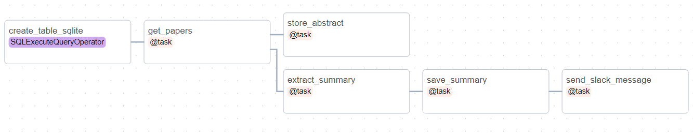

# Latest-AI-Papers-Summary
Summarize the latest daily ML/AI Papers from Arxiv print. It Uses the Airflow Scheduler, OpenAI GPT3.5 LLM to Summarize and send to personal Slack chat using the SlackAPI.

## Description
[Arxiv](https://arxiv.org/) is a website that serves as a platform for researchers to share their scientific and academic papers with the global research community. In this project, we scrap the Arxiv's [CS/AI section](https://arxiv.org/list/cs.AI/new) for daily new research papers. Read the title,abstract of each paper. Use the OpenAPI's GPT3.5 to summarise and store the summary into a SqLiteDB and also send a Slack message with the paper's summary. This setup runs in Airflow DAG with a daily scheduler.

## Setup
1. Clone the repo. From your terminal
~~~    
git clone https://github.com/dheerajvarma24/Latest-AI-Papers-Summary.git
cd Latest-AI-Papers-Summary
~~~

2. Create a virtual environment. To create a virtual conda env (replace the <env_name> with your env name)
~~~
conda create -n <env_name> python=3.7
conda activate <env_name>
~~~

3. Airflow must be installed and running. Refer to our **Prerequisites** section below.

4. Create a SQLite DB to store the summaries of the papers and add the DB connection to the Airflow.
Type the following commands in your project terminal.
~~~
sqlite3 summary.db
.quit
airflow connections add 'summary' --conn-type 'sqlite' --conn-host '/home/<username>/Latest-AI-Papers-Summary/summary.db'
airflow connections get summary
~~~

5. Install the requirements
~~~
pip install -r requirements.txt
~~~

6. Replace the OpenAI and Slack API keys in the .env file. Refer to the **Prerequisites** section to generate these keys.

7. Run the airflow scheduler
~~~
airflow standalone
~~~

This will send the summary of the latest papers to your slack channel. You can also check the summary in the SQLite DB. This will also save a copy of the summary in the `./papers` directory.

If you wish to login to the airflow's webserver, goto localhost:8080 and login with the username and password. Search for the `airflow standalone` logs for the temporary username and password.

DAG structure is as follows:



## Prerequisites

* To install airflow follow their [documentation](https://airflow.apache.org/docs/apache-airflow/stable/start.html) or if you are comfortable with a video tutorial, follow this [video](https://youtu.be/s-r2gEr7YW4?si=Q4maK_j38RO9vwSQ&t=104)
  After installing, this will create a directory named 'Airflow' to store airflow's configs in your home dir. You need to modify the DAG's path inside the airflow config file to point to our project's path (where our DAGs are defined).
  ```
  Find `home/<username>/airflow` dir then open `airflow` config file, and modify the line 'dags_folder` to your present workdir where this project code is present.
  For example, dags_folder= /home/<username>/airflow to dags_folder=/home/<username>/Latest-AI-Papers-Summary
  ```

* To create a [OpenAI account](https://openai.com/) and generate an API key. [Reference](https://www.youtube.com/watch?v=nafDyRsVnXU&ab_channel=TutorialsHub )
  
* To create a Slack app and get the API key. Please take a look at this for more details and follow the steps. [Reference](https://codeflex.co/send-message-to-slack-with-python/)


## NOTE on OpenAI API Free users.
It gives a free one-time 5-dollar credit.
Only 3 requests can be sent to their LLM models per minute. Therefore at the moment only top 3 papers are being summarised and sent to slack.

## Further TODO's
1. Use Hugging Face LLM models and give the user the choice to choose from OPENAI GPT models vs hf LLM models.
2. Containerize the application using Docker.